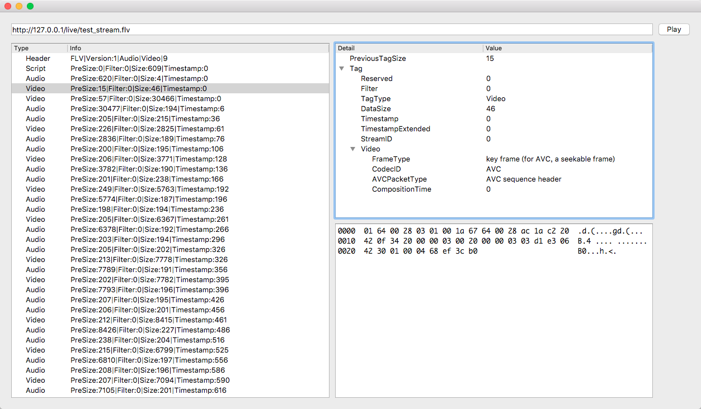

# Flv Parser

解析在线 FLV 流，输出该 FLV 流的详细信息。

## 简介

在 macOS 上，一直没有找到比较好用的 FLV 分析工具，所以使用 QT 实现了一个简单的 FLV 分析工具：

1. 支持 HTTP FLV 拉流分析；
2. 支持 FLV 各个包的基本信息展示；
3. 支持 FLV 各个字段的详细内容展示；
4. 支持 FLV 音视频的二进制数据展示；

## 使用方式

1. 打开工具，填写 HTTP FLV 的地址，并点击 Play 按钮；
2. 此时会不断拉取 FLV 的流数据，并展示基本信息；
3. 点击 Stop 按钮；
4. 选择想要分析的内容，进行详细内容的查看；

## 捐赠

如果 FLV Parser 对您有所帮助，欢迎进行捐赠以支持该项目发展。

